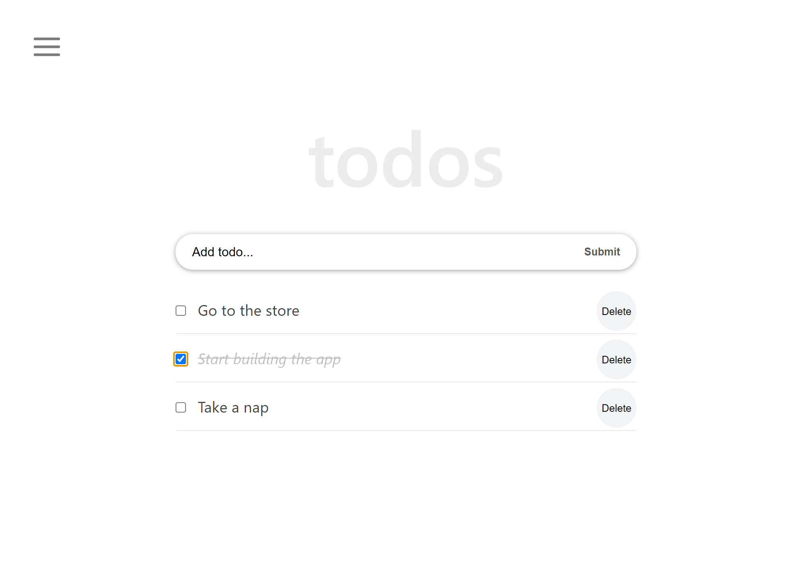

# Todo Aopp With React
> Todo app is a Single-Page application helps you stay organized in your daily tasks as you can `add`, `remove`, `edit`, and also mark task as `completed`. Data in this app has been preserved using `localStorage`. This app was built according to the steps provided in the [React Tutorial From Scratch: A Step-by-Step Guide (2021)](https://ibaslogic.com/react-tutorial-for-beginners/)

# Live Link

Kindly click to view the [App](https://dammyshittu.github.io/react-todo-app/)

# Screenshot

# Getting Started

To get a local copy up and running follow these simple steps.

- You can clone this repo by typing `https://github.com/DammyShittu/react-todo-app.git` on your terminal.

- Type `cd react-todo-app` to access the project on the terminal.
  
- Run `npm install` from your editor's terminal.

- Run `npm start` from your editor's terminal to run the app in the development mode.

- Run `npm run build` to build the app for production.
# Testing

- Run `npm test` to launch the test runner in the interactive watch mode

# Language Used:

This project was bootstrapped with [Create React App](https://github.com/facebook/create-react-app).

# Version Control System

GIT

# 👤 Author

GitHub: [@dammyShittu](https://github.com/DammyShittu/)

Twitter: [@aded_shittu](https://twitter.com/aded_shittu/)

LinkedIn: [Adedamola Shittu](linkedin.com/in/adedamola-shittu-3ab465172/)

# 🤝 Contributing

Contributions, issues, and feature requests are welcome!

Feel free to check the [issues page](https://github.com/DammyShittu/react-todo-app/issues).

# Acknowledgement

Big thanks to Ibas Majid for making this [tutorial](https://ibaslogic.com/react-tutorial-for-beginners/) available.
# Show your support

Give a ⭐️ if you like this project!

# 📝 License

This project is [MIT](LICENSE) licensed.